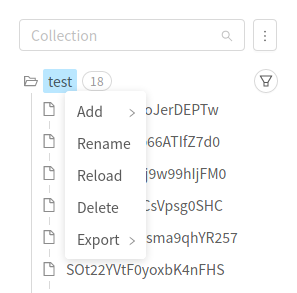
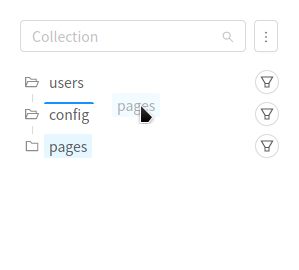

#  Firestore Manager

[](https://addons.mozilla.org/firefox/addon/firestore-manager/?src=external-github-shield-downloads)
[](https://addons.mozilla.org/firefox/addon/firestore-manager/?src=external-github-shield-downloads)
[](https://addons.mozilla.org/firefox/addon/firestore-manager/statistics/)
[](https://addons.mozilla.org/firefox/addon/firestore-manager/reviews/)
[](https://www.paypal.me/axeldev)
[](https://hits.seeyoufarm.com)

A simple, fast and intuitive web-extension to manage firestore databases, made with [Angular](https://github.com/angular).


:warning: This project is still work in progress & may not be suited for production use.

## Features

<!-- - Clean UI (based on [ng-zorro-antd](https://github.com/NG-ZORRO/ng-zorro-antd)). -->

- Easily Add/Clone/Rename/Delete/Filter collections & documents.
- 3 editing modes (thanks to [jsoneditor](https://github.com/josdejong/jsoneditor) project).
- Powerful diff viewer (using [diff-match-patch](https://github.com/google/diff-match-patch) & [diff2html](https://github.com/rtfpessoa/diff2html)).
- JSON export/import.
- Firebase Authentication Support (Anonymous, email & password, JWT token).
- [Experimental] Databases Auto Backup (webextension only).

## Installation

[](https://addons.mozilla.org/firefox/addon/firestore-manager/?src=external-github-download)
[](https://github.com/FirebaseGoodies/firestore-manager/releases)

Or [try it as a web application](https://firebasegoodies.github.io/firestore-manager/manager).

[How to install?](https://github.com/AXeL-dev/install-webextension)

## Tips

<table>
  <tr align="center">
    <td>
      
    </td>
    <td>
      
    </td>
  </tr>
  <tr align="center">
    <td>
      Right click on any collection or document name to get more options
    </td>
    <td>
      Move collections using drag-n-drop
    </td>
  </tr>
  <tr align="center">
    <td colspan="2">
      
    </td>
  </tr>
  <tr align="center">
    <td colspan="2">
      Use the json editor menu options to perform actions like auto-fix json errors, fix alignment, undo/redo changes, ...
    </td>
  </tr>
</table>

## Todo

- [x] Translations
- [x] Add collections filter (field - operator - value)
- [ ] Refactor long components code (create a module for each main component)
- [ ] Handle sub-collections
- [ ] Add unit tests

## Development server

Run `ng serve` for a dev server. Navigate to `http://localhost:4200/`. The app will automatically reload if you change any of the source files.

## Build

Run `ng build` to build the project. The build artifacts will be stored in the `dist/` directory. Use the `--prod` flag for a production build.

## Package

Make sure you have the following package installed `npm install -g web-ext`. Then run:

```
npm run build && npm run package
```

## Deploy on github pages

Make sure you have the following package installed `npm install -g angular-cli-ghpages`. Then run:

```
npm run build:github && npm run deploy:github
```

## License

Firestore Manager is licensed under the [MPL2](LICENSE) license.
